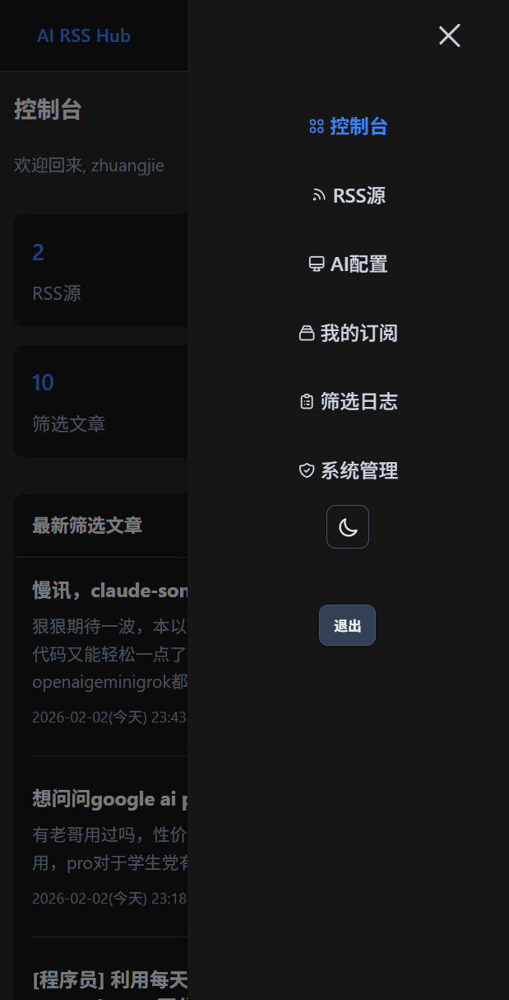
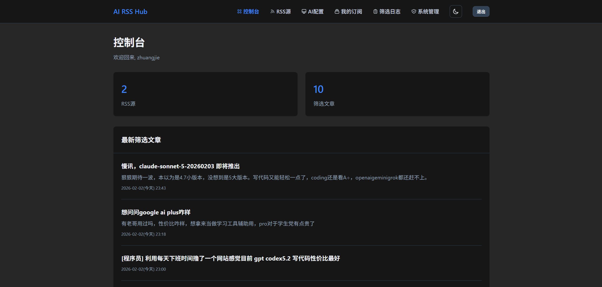

# AI RSS Hub

一个基于 Spring Boot 开发的智能 RSS 聚合器，支持 AI 智能摘要、关键词订阅、邮件推送等功能。

## 功能特性

- **RSS 源管理**：支持添加、编辑、删除 RSS 源，自动抓取更新
- **AI 智能摘要**：集成 OpenAI、DeepSeek 等主流 AI 模型，自动为文章生成摘要
- **关键词订阅**：支持设置关键词，自动匹配并推送相关文章
- **邮件推送**：支持邮件订阅，定时推送最新内容
- **用户管理**：支持多用户注册登录，个人订阅管理
- **响应式界面**：基于 Thymeleaf 的简洁 Web 界面

移动网页：



PC网页：




## 技术栈

- **后端框架**：Spring Boot 2.7.18
- **模板引擎**：Thymeleaf
- **数据库**：SQLite
- **RSS 解析**：Rome
- **HTTP 客户端**：OkHttp3
- **缓存**：Caffeine
- **构建工具**：Maven

## 快速开始

### 快速部署
```bash
git clone https://github.com/My-Search/ai-rss-hub.git
cd ai-rss-hub
docker-compose build --no-cache
docker-compose up -d
# 访问http://ip:2799，第一个注册用户即为管理员
# 后续更新`bash update.sh`
```
### 环境要求

- JDK 8+
- Maven 3.6+
- Docker（可选）

### 本地运行

1. 克隆项目
```bash
git clone <repository-url>
cd ai-rss-hub
```

2. 编译运行
```bash
mvn clean package -DskipTests
java -jar target/ai-rss-hub-1.0.0.jar
```

3. 访问应用
打开浏览器访问 http://localhost:8080

## 配置说明

### AI 配置

在系统设置中配置 AI 服务：
- **API 地址**：OpenAI 或兼容的 API 端点
- **API Key**：你的 API 密钥
- **模型名称**：如 `gpt-3.5-turbo`、`deepseek-chat` 等
- **是否为推理模型**：自动识别或手动设置

### RSS 抓取配置

在 `application.yml` 中配置：
```yaml
rss:
  default-refresh-interval: 10  # 默认刷新间隔（分钟）
  timezone: GMT+8              # 时区设置
  fetch:
    thread-pool:
      core-size: 5             # 核心线程数
      max-size: 10             # 最大线程数
    batch-size: 100            # 批量处理大小
    check-interval-seconds: 10 # 检查间隔（秒）
```

## 项目结构

```
ai-rss-hub/
├── src/main/java/com/rssai/
│   ├── config/          # 配置类
│   ├── controller/      # 控制器
│   ├── service/         # 业务逻辑
│   ├── mapper/          # 数据访问层
│   ├── model/           # 实体类
│   ├── security/        # 安全相关
│   └── util/            # 工具类
├── src/main/resources/
│   ├── templates/       # Thymeleaf 模板
│   ├── static/          # 静态资源
│   └── application*.yml # 配置文件
├── Dockerfile
├── docker-compose.yml
└── pom.xml
```

## 开发说明

### 数据库

项目使用 SQLite 数据库，数据文件位于 `data/rss.db`。首次启动时会自动初始化表结构。

### 日志

日志文件默认输出到 `logs/console.log`，可在 `application.yml` 中配置：
```yaml
system:
  log:
    max-lines: 300              # 最大保留行数
    console-path: logs/console.log
```

### 邮件服务

支持 SMTP 邮件发送，在系统设置中配置邮件服务器信息。

## 许可证

MIT License
