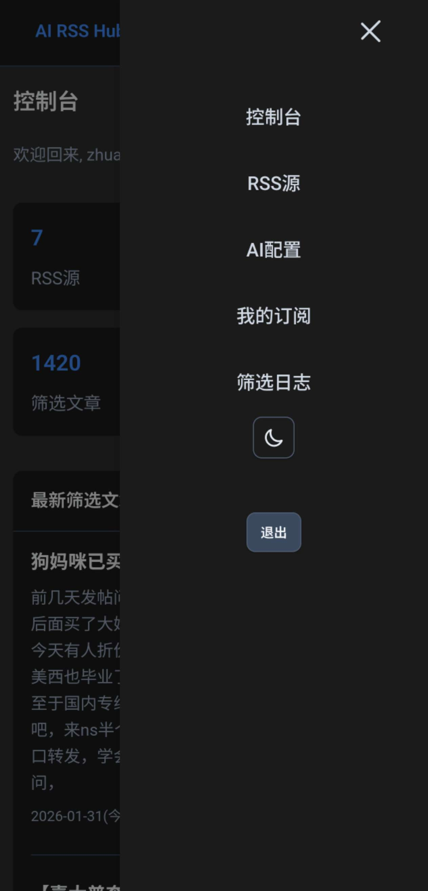
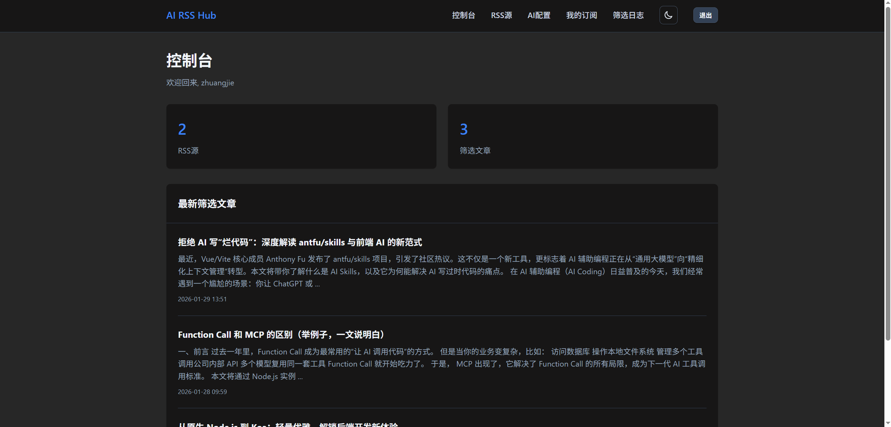

# AI RSS Hub


一个基于 Spring Boot 的智能 RSS 过滤系统，集成 AI 能力实现个性化内容筛选。支持多用户、多 RSS 源，自动处理并生成符合个人偏好的自定义 RSS 订阅。


移动网页：


PC网页：



---

## 功能特性

| 核心功能 | 功能特点 |
|---------|---------|
| **多用户系统** | 独立账号管理，每个用户拥有独立的配置和数据隔离 |
| **AI 智能筛选** | 集成 AI API，根据自定义提示词智能筛选 RSS 内容 |
| **多源聚合** | 支持配置多个 RSS 源，统一管理 |
| **自定义 AI 配置** | 灵活配置 API Base URL、模型名称、API Key |
| **系统提示词** | 可自定义 AI 筛选偏好，实现精准个性化 |
| **灵活调度** | 可配置每个 RSS 源的刷新频率（默认 10 分钟） |
| **个人订阅** | 每个用户生成专属 RSS 订阅地址 |
| **邮件摘要** | 支持定期邮件推送精选内容摘要 |
| **关键词订阅** | 支持关键词订阅，匹配内容时自动发送邮件通知 |
| **邮箱验证** | 支持注册验证码和密码重置功能 |
| **记住我** | 支持"记住我"登录功能 |
| **日志追溯** | 完整的筛选日志和抓取日志记录 |
| **企业级界面** | 专业扁平化设计，响应式布局 |

---

## 技术栈

### 后端框架
- **Spring Boot 2.7.18** - 核心应用框架
- **Spring Security** - 安全认证与授权
- **Spring JDBC** - 数据库访问层

### 数据库
- **SQLite 3.42.0.0** - 轻量级嵌入式数据库

### 模板引擎
- **Thymeleaf** - 服务端模板渲染

### RSS 处理
- **Rome 1.18.0** - RSS 解析与生成

### 工具库
- **Lombok** - 代码简化
- **OkHttp 4.9.3** - HTTP 客户端
- **Gson** - JSON 处理
- **Spring Mail** - 邮件发送
- **Caffeine** - 高性能缓存库（用于验证码存储）

### 容器化
- **Docker** + **Docker Compose** - 容器化部署支持

---

## 快速开始

### 环境要求

- **JDK 1.8+**
- **Maven 3.6+**
- **可选：Docker 20.10+**

### 快速部署
```bash
git clone https://github.com/My-Search/ai-rss-hub.git
cd ai-rss-hub
# 想要添加邮件相关功能，如订阅消息，注册需要验证码验证，请编辑docker-compose.yml 配置
docker-compose build --no-cache
docker-compose up -d
# 访问http://ip:2799
# 后续更新`bash update.sh`
```

### 本地安装运行
#### 1. 克隆项目

```bash
git clone https://github.com/your-username/ai-rss-hub.git
cd ai-rss-hub
```

#### 2. 编译项目

```bash
mvn clean package -DskipTests
```

#### 3. 运行应用

**方式一：使用 JAR 文件**

```bash
java -jar target/ai-rss-hub-1.0.0.jar
```

**方式二：使用 Maven 插件**

```bash
mvn spring-boot:run
```

#### 4. 访问应用

默认地址：``http://localhost:8080``

---

## Docker 部署

### 使用 Docker Compose（推荐）

```bash
docker-compose up -d
```

服务将在 ``http://localhost:2799`` 启动。

### 使用 Docker 构建

```bash
docker build -t ai-rss-hub:1.0.0 .
docker run -d -p 2799:8080 -v $(pwd)/data:/app/data ai-rss-hub:1.0.0
```

### 健康检查

容器包含内置健康检查，每 30 秒检查一次服务状态。

---

## 使用说明

### 1. 用户注册

访问注册页面创建新账号：

```
http://localhost:8080/register
```

**邮箱验证功能**（可选）：
- 如启用邮件功能，注册时需要输入邮箱并验证验证码
- 点击"发送验证码"按钮，系统会发送6位数字验证码到您的邮箱
- 输入验证码后完成注册

### 2. 找回密码

忘记密码时，可通过邮箱重置：

```
http://localhost:8080/forgot-password
```

- 输入注册时使用的邮箱
- 点击"发送验证码"获取密码重置验证码
- 输入验证码和新密码完成重置

### 3. 配置 AI

登录后进入**AI配置**页面，填写以下信息：

| 配置项 | 说明 | 示例 |
|-------|------|------|
| API Base URL | AI API endpoint | https://api.openai.com/v1 |
| Model Name | 使用的模型 | gpt-3.5-turbo |
| API Key | API 认证密钥 | sk-... |
| 系统提示词 | 筛选偏好描述 | 只关注与机器学习相关的技术文章 |

### 4. 添加 RSS 源

进入**RSS源**页面管理订阅源：

- 点击"添加 RSS 源"
- 输入 RSS 订阅地址
- 设置刷新频率（单位：分钟）
- 保存配置

### 5. 关键词订阅

进入**关键词订阅**页面设置关键词匹配规则：

- 点击"添加关键词订阅"
- 输入关键词（多个关键词用空格分隔，使用 AND 逻辑）
- 例如："glm 最新模型" 表示文章必须同时包含"glm"和"最新模型"
- 当 RSS 内容匹配关键词时，系统会自动发送邮件通知
- 可随时启用/禁用或删除关键词订阅

### 6. 获取个人订阅地址

在**AI配置**页面底部，系统将生成您的专属 RSS 订阅地址。复制该地址到任意 RSS 阅读器即可使用。

### 7. 查看日志

- **筛选日志**：查看 AI 处理记录
- **抓取日志**：查看 RSS 源抓取状态

---

## 配置说明

### 应用配置（application.yml）

```yaml
server:
  port: 8080                    # 服务端口

spring:
  datasource:
    url: jdbc:sqlite:data/rss.db  # 数据库路径
    driver-class-name: org.sqlite.JDBC

rss:
  default-refresh-interval: 10    # 默认刷新间隔（分钟）
```

### 邮件配置

如需启用邮件摘要功能，在 `application.yml` 中添加：

```yaml
spring:
  mail:
    host: smtp.example.com
    port: 587
    username: your-email@example.com
    password: your-password
    properties:
      mail:
        smtp:
          auth: true
          starttls:
            enable: true

email:
  enable: true  # 启用邮件功能（验证码、密码重置等）

system-config:
  allow-register: true  # 允许用户注册
```

### 数据存储

- **数据库文件**：`data/rss.db`
- **数据持久化**：所有用户数据和配置均存储在 SQLite 数据库中

---

## 项目结构

```
ai-rss-hub/
├── src/main/java/com/rssai/
│   ├── config/                    # 配置类
│   │   ├── SecurityConfig.java    # Spring Security 配置
│   │   ├── JdbcConfig.java        # 数据库连接配置
│   │   ├── DatabaseInitializer.java # 数据库初始化
│   │   ├── UserDetailsServiceImpl.java # 用户详情服务
│   │   ├── AsyncConfig.java       # 异步配置
│   │   ├── CaffeineCacheConfig.java # 缓存配置
│   │   └── TimezoneConfig.java    # 时区配置
│   ├── controller/                # 控制器层
│   │   ├── AuthController.java    # 认证控制器
│   │   ├── AiConfigController.java # AI 配置控制器
│   │   ├── RssSourceController.java # RSS 源管理
│   │   ├── RssFeedController.java # RSS 订阅接口
│   │   ├── DashboardController.java # 仪表盘
│   │   ├── EmailController.java   # 邮件设置
│   │   ├── FilterLogController.java # 筛选日志
│   │   ├── UserFeedController.java # 用户订阅管理
│   │   └── KeywordSubscriptionController.java # 关键词订阅管理
│   ├── mapper/                    # 数据访问层
│   │   ├── UserMapper.java        # 用户数据
│   │   ├── AiConfigMapper.java    # AI 配置数据
│   │   ├── RssSourceMapper.java   # RSS 源数据
│   │   ├── RssItemMapper.java     # RSS 条目数据
│   │   ├── UserRssFeedMapper.java # 用户订阅数据
│   │   ├── FilterLogMapper.java   # 筛选日志数据
│   │   ├── KeywordSubscriptionMapper.java # 关键词订阅数据
│   │   └── KeywordMatchNotificationMapper.java # 关键词匹配通知数据
│   ├── model/                     # 数据模型
│   │   ├── User.java              # 用户实体
│   │   ├── AiConfig.java          # AI 配置实体
│   │   ├── RssSource.java         # RSS 源实体
│   │   ├── RssItem.java           # RSS 条目实体
│   │   ├── UserRssFeed.java       # 用户订阅实体
│   │   ├── FilterLog.java         # 筛选日志实体
│   │   ├── KeywordSubscription.java # 关键词订阅实体
│   │   └── KeywordMatchNotification.java # 关键词匹配通知实体
│   ├── service/                   # 业务逻辑层
│   │   ├── UserService.java       # 用户服务
│   │   ├── AiService.java         # AI 处理服务
│   │   ├── RssFetchService.java   # RSS 抓取服务
│   │   ├── RssGeneratorService.java # RSS 生成服务
│   │   ├── EmailService.java      # 邮件服务
│   │   ├── EmailScheduler.java    # 邮件调度器
│   │   ├── FilterLogService.java  # 日志服务
│   │   ├── KeywordSubscriptionService.java # 关键词订阅服务
│   │   └── VerificationCodeService.java # 验证码服务
│   ├── security/                  # 安全相关
│   │   └── JdbcTokenRepositoryImpl.java # JDBC Token 持久化实现
│   ├── util/                      # 工具类
│   │   └── HtmlUtils.java         # HTML 处理工具
│   └── RssAiApplication.java      # 应用启动类
├── src/main/resources/
│   ├── templates/                 # Thymeleaf 模板
│   │   ├── fragments/             # 模板片段
│   │   ├── ai-config.html         # AI 配置页面
│   │   ├── dashboard.html         # 仪表盘
│   │   ├── email-digest.html      # 邮件摘要模板
│   │   ├── email-keyword-match.html # 关键词匹配邮件模板
│   │   ├── email-password-reset-code.html # 密码重置邮件模板
│   │   ├── email-register-code.html # 注册验证码邮件模板
│   │   ├── email-test.html        # 测试邮件模板
│   │   ├── feed.html              # 订阅页面
│   │   ├── filter-logs.html       # 筛选日志页面
│   │   ├── forgot-password.html   # 忘记密码页面
│   │   ├── keyword-subscriptions.html # 关键词订阅页面
│   │   ├── login.html             # 登录页面
│   │   └── register.html          # 注册页面
│   ├── static/                    # 静态资源
│   │   ├── css/                   # 样式文件
│   │   └── favicon.svg            # 网站图标
│   ├── application.yml            # 应用配置文件
│   ├── application-dev.yml        # 开发环境配置
│   └── application-prod.yml       # 生产环境配置
├── data/                          # 数据目录（数据库文件）
├── Dockerfile                     # Docker 构建文件
├── docker-compose.yml             # Docker Compose 配置
├── pom.xml                        # Maven 依赖配置
├── update.sql                     # 数据库更新脚本
├── update.sh                      # 更新脚本
└── README.md                      # 项目说明文档
```

---

## 数据库设计

### 核心数据表

#### 用户表（users）

| 字段 | 类型 | 说明 |
|-----|------|------|
| id | INTEGER | 主键 |
| username | VARCHAR | 用户名（唯一） |
| password | VARCHAR | 加密密码 |
| email | VARCHAR | 邮箱地址 |
| created_at | TIMESTAMP | 创建时间 |

#### AI 配置表（ai_config）

| 字段 | 类型 | 说明 |
|-----|------|------|
| id | INTEGER | 主键 |
| user_id | INTEGER | 关联用户ID |
| api_url | VARCHAR | API Base URL |
| model_name | VARCHAR | 模型名称 |
| api_key | VARCHAR | API Key |
| system_prompt | TEXT | 系统提示词 |

#### RSS 源表（rss_sources）

| 字段 | 类型 | 说明 |
|-----|------|------|
| id | INTEGER | 主键 |
| user_id | INTEGER | 关联用户ID |
| url | VARCHAR | RSS 源地址 |
| name | VARCHAR | RSS 源名称 |
| refresh_interval | INTEGER | 刷新间隔（分钟） |
| active | BOOLEAN | 是否启用 |

#### RSS 条目表（rss_items）

| 字段 | 类型 | 说明 |
|-----|------|------|
| id | INTEGER | 主键 |
| source_id | INTEGER | 关联源ID |
| title | VARCHAR | 文章标题 |
| link | VARCHAR | 文章链接 |
| description | TEXT | 文章描述 |
| pub_date | TIMESTAMP | 发布时间 |
| filtered | BOOLEAN | 是否通过筛选 |

#### 用户订阅表（user_rss_feeds）

| 字段 | 类型 | 说明 |
|-----|------|------|
| id | INTEGER | 主键 |
| user_id | INTEGER | 用户ID |
| feed_token | VARCHAR | 订阅令牌（唯一） |
| created_at | TIMESTAMP | 创建时间 |

#### 筛选日志表（filter_logs）

| 字段 | 类型 | 说明 |
|-----|------|------|
| id | INTEGER | 主键 |
| user_id | INTEGER | 用户ID |
| item_id | INTEGER | 关联条目ID |
| result | BOOLEAN | 筛选结果 |
| reason | TEXT | 筛选原因 |
| created_at | TIMESTAMP | 处理时间 |

#### 关键词订阅表（keyword_subscriptions）

| 字段 | 类型 | 说明 |
|-----|------|------|
| id | INTEGER | 主键 |
| user_id | INTEGER | 用户ID |
| keywords | VARCHAR | 关键词（空格分隔） |
| enabled | BOOLEAN | 是否启用 |
| created_at | TIMESTAMP | 创建时间 |
| updated_at | TIMESTAMP | 更新时间 |

#### 关键词匹配通知表（keyword_match_notifications）

| 字段 | 类型 | 说明 |
|-----|------|------|
| id | INTEGER | 主键 |
| user_id | INTEGER | 用户ID |
| subscription_id | INTEGER | 关联关键词订阅ID |
| item_id | INTEGER | 关联RSS条目ID |
| sent | BOOLEAN | 是否已发送邮件 |
| created_at | TIMESTAMP | 创建时间 |

#### 持久化登录表（persistent_logins）

| 字段 | 类型 | 说明 |
|-----|------|------|
| username | VARCHAR | 用户名 |
| series | VARCHAR | 系列标识（主键） |
| token | VARCHAR | 令牌 |
| last_used | TIMESTAMP | 最后使用时间 |

---

## 常见问题

### Q: 如何修改服务端口？

在 `application.yml` 中修改 `server.port` 配置。

### Q: 支持哪些 AI 服务？

支持任何兼容 OpenAI API 格式的服务，包括 OpenAI、Azure OpenAI、Anthropic 等。

### Q: 如何备份数据？

备份 `data/rss.db` 数据库文件即可。

### Q: RSS 刷新不工作？

检查：
1. RSS 源地址是否正确
2. 网络连接是否正常
3. `refresh_interval` 是否设置合理

### Q: 邮件发送失败？

确认邮件配置正确，包括 SMTP 服务器、端口、认证信息等。

### Q: 关键词订阅如何工作？

- 关键词使用 AND 逻辑匹配，多个关键词用空格分隔
- 系统会检查 RSS 条目的标题和描述
- 匹配成功后自动发送邮件通知
- 需要启用邮件功能才能使用

### Q: 如何启用邮箱验证功能？

在 `application.yml` 中配置邮件服务器，并设置 `email.enable: true`。

### Q: 如何关闭用户注册功能？

在 `application.yml` 中设置 `system-config.allow-register: false`。

### Q: 验证码有效期多久？

验证码存储在 Caffeine 缓存中，默认有效期为 10 分钟。

### Q: "记住我"功能如何使用？

登录时勾选"记住我"选项，系统会在数据库中持久化登录令牌，下次访问时自动登录。

---

## 路线图

- [ ] 支持更多 RSS 格式
- [ ] 提供用户自定义过滤规则
- [ ] 添加 Webhook 支持
- [ ] 支持 RSS 内容全文提取
- [ ] 提供数据统计与分析
- [ ] 支持 API 接口访问
- [ ] 添加用户角色与权限管理
- [ ] 支持 OAuth 第三方登录

---

## 贡献指南

欢迎贡献代码！请遵循以下步骤：

1. Fork 本仓库
2. 创建特性分支 (`git checkout -b feature/AmazingFeature`)
3. 提交更改 (`git commit -m 'Add some AmazingFeature'`)
4. 推送到分支 (`git push origin feature/AmazingFeature`)
5. 开启 Pull Request

### 代码规范

- 遵循 Java 标准编码规范
- 使用 Lombok 简化代码
- 添加必要的注释
- 确保代码通过编译和测试

---

## 许可证

本项目采用 MIT 许可证。详见 [LICENSE](LICENSE) 文件。

---

## 联系方式

- 项目主页：https://github.com/your-username/ai-rss-hub
- 问题反馈：https://github.com/your-username/ai-rss-hub/issues

---

**Built with ❤️ by AI RSS Hub Team**
